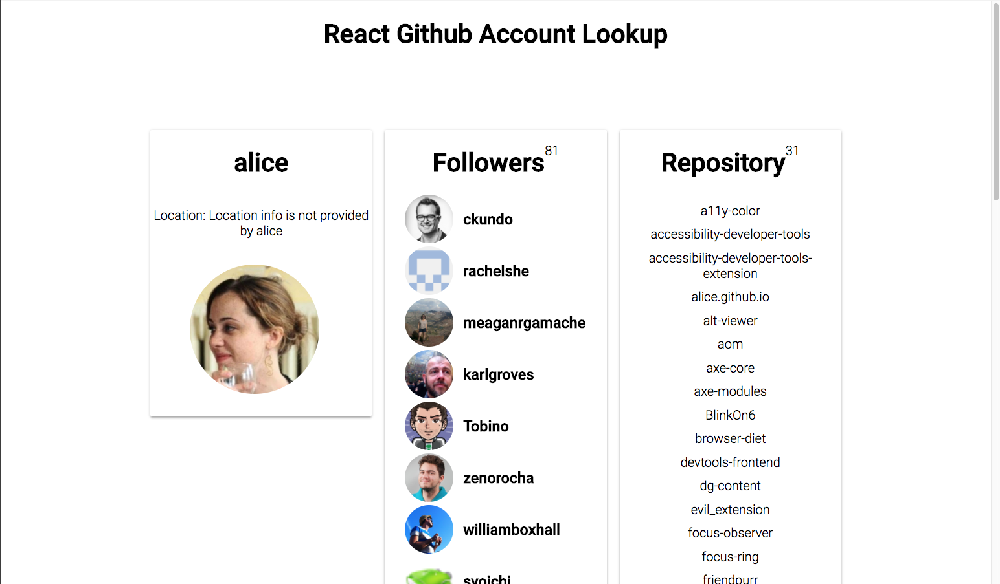

## React Github API Account Lookup Web App

### Challenge and Solution

This is a fairly simple function app for Github API Account Lookup by entering Github user name.

### Techical Specs

This app is built by HTML5, Sass, ES6, Bable, webpack, React and React Router 4. All the code are generated by myself with extensive research and reasoning.(No boilerplates used)

The reason for using React js is because it's one of the most advanced front end UI frameworks. It uses virtual DOM to render the UI that improves the performance of UI rendering dramatically. It uses an algorithm called `DOM diff` to calculate all the changes in the Virtual DOM. Then it will only change the real DOM after the Virtual DOM figured out all the calculation.

Also, React is a component oriented library which can be very scalable and customizable. Because of its component-based, it's very easy for testing too. React component is a function, the state is the reference to its internal situation, props is the parameter.

For me, there is a lot of pleasure for writing react app. After an enough learning curve, I found very comfortable to write react because of its clean syntax, light API, and very stable component.

#### Service Worker, Caching and Offline First
On a slow connection, the browser will get data on the screen a whole lot faster with the serve cached solution.

On the offline mode, the browser will deliver stuff rather than a black screen.

- Unobtrusive app updates.
- Get the user onto the latest version.
- Continually update cache of posts.
- Cache photos.
- Cache avatars.

### Other code
https://github.com/ptchiangchloe/catalog_app

### LinkedIn
https://www.linkedin.com/in/hanyujiangus/
